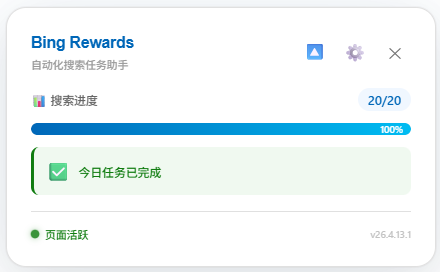
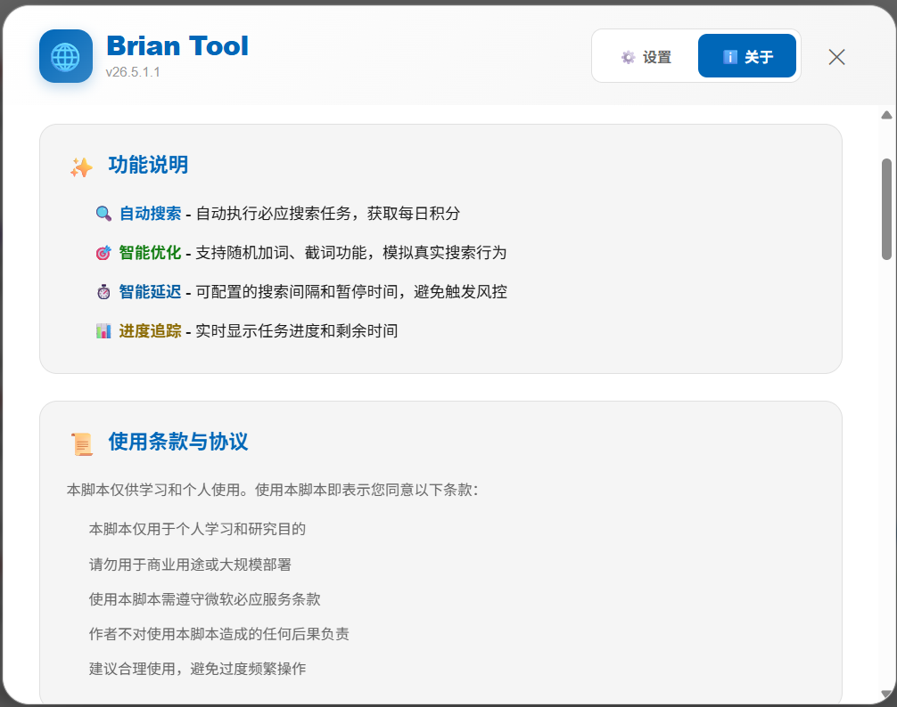

# Microsoft Bing Rewards 自动化工具集


---

**🤖 自动化完成微软必应每日搜索任务，智能积累奖励积分**

本项目提供多种实现方式，帮助您自动完成 Microsoft Bing Rewards 的每日搜索任务，节省时间并轻松获取积分奖励。

---

## 📦 版本选择

本项目提供 **多种实现方式**，满足不同场景需求：

| 版本 | 技术栈 | 适用场景 | 特点 |
|------|--------|----------|------|
| 🌐 **浏览器脚本**（推荐使用） | JavaScript + Violentmonkey | 全平台浏览器 | 轻量便捷，无需安装 |
| 🖥️ **Python 桌面程序** | Python | Windows 用户 | 功能丰富，配置灵活 |
| 🧩 ~~**浏览器扩展**~~（停止维护） | Chrome Extension (Manifest V3) | 全平台浏览器 | 双端搜索，无需脚本管理器 |
| 🪟 ~~**.NET 桌面程序**~~（停止维护） | .NET Framework | Windows 用户 | 运行稳定，开箱即用 |

### 🐍 Python 桌面版

> 基于 Python 实现的桌面自动化工具，支持 Windows 系统，配置灵活，功能丰富。

👉 **[查看 Python 版本文档](bing-rewards-python/README.md)**

### 🪟 ~~.NET 桌面版~~（停止维护）

> 基于 .NET Framework 开发的 Windows 桌面程序，运行稳定，操作简单。

👉 **[查看 .NET 版本文档](bing-rewards-simulator/README.md)**

### 🧩 ~~浏览器扩展版~~（停止维护）

> 基于 Manifest V3 的 Chrome 扩展，支持 PC / 移动端双端搜索，无需安装脚本管理器。

👉 **[查看浏览器扩展文档](bing-rewards-extension/README.md)**

### 🌐 Violentmonkey 浏览器脚本版

> 纯粹的前端用户脚本，运行于浏览器沙盒环境中，跨平台支持，轻量便捷。

#### 📸 界面预览

**展开状态 - 完整信息展示**



**收起状态 - 紧凑模式**


**设置面板**


**关于面板**




👉 **[查看浏览器脚本说明](#-浏览器脚本版快速开始)**

---

## 🌐 浏览器脚本版快速开始

### ✨ 核心特性

#### 🎯 智能自动化
- **全自动任务执行**：一键启动，自动完成当日所有搜索任务
- **智能进度管理**：实时显示任务进度与剩余时间，完成情况一目了然

#### 🔒 安全模拟
- **动态搜索策略**：内置丰富词库，自动获取并随机使用热搜关键词
- **行为混淆技术**：支持随机化 User-Agent 与搜索词混淆，降低自动化识别风险
- **隐私保护**：纯前端运行，**不收集、不上传任何 Cookie 或个人信息**

#### 🎨 现代 UI
- **实时状态面板**：优雅的渐变设计与流畅动画，实时追踪任务进度
- **可视化配置**：图形化设置界面，参数调整直观便捷
- **暗色主题支持**：自动适配系统级暗色模式

### 🚀 安装与使用

#### 步骤 1：安装脚本管理器

本脚本需要用户脚本管理器扩展运行，推荐使用 **Edge 浏览器** 和开源的 **Violentmonkey**：

- **Microsoft Edge**：[Edge 加载项商店](https://microsoftedge.microsoft.com/addons/detail/violentmonkey/eeagobfjdenkkddmbclomhiblgggliao)
- **Firefox**：[Firefox 附加组件商店](https://addons.mozilla.org/firefox/addon/violentmonkey/)
- **Chrome/其他浏览器**：[Chrome 网上应用店](https://chrome.google.com/webstore/detail/violentmonkey/jinjaccalgkegednnccohejagnlnfdag)

> ⚠️ **注意**：若非从官方商店安装，请在浏览器扩展管理页面开启**"开发者模式"**。

#### 步骤 2：安装脚本

点击以下链接，Violentmonkey 将自动提示安装：

👉 **[一键安装脚本](https://gitee.com/idbb98/microsoft-bing-rewards-daily-task-script/raw/master/BingRewards.user.js)**

在安装确认页面点击 **"安装"** 按钮即可。

#### 步骤 3：配置参数

> 首次使用前，需要配置关键参数以确保脚本正常运行。

**⚙️ 必填配置：搜索 form 参数**

- **默认值**：`QBLH`（必须修改）
- **获取方法**：
  1. 打开 [https://cn.bing.com](https://cn.bing.com) 并登录微软账户
  2. 执行几次搜索操作
  3. 查看地址栏 URL，提取 `form=xxx` 中的 `xxx` 值
  4. 在脚本设置中替换 `searchFormParam` 字段

**🔧 可选配置**

- **最大搜索次数**：默认 `20`，根据个人需求调整
- **随机加词/截词**：默认关闭，开启后增强行为真实性
- **暂停间隔**：支持区间随机配置，模拟真人使用习惯

#### 步骤 4：运行脚本

1. **打开 Bing**：访问 [https://www.bing.com](https://www.bing.com) 并**确保已登录微软账户**
2. **启动任务**：
   - 点击浏览器工具栏的 **Violentmonkey** 图标
   - 在菜单中找到 **"开始Bing任务"** 并点击
3. **等待完成**：
   - 页面顶部将显示进度面板
   - **请保持标签页为前台激活状态**，不要最小化或切换标签
   - 任务完成后会自动停止

---

## ⚠️ 注意事项与常见问题

### 📋 使用前提

- ✅ **必须登录**：使用前请在 Bing 网页版登录微软账户
- ✅ **保持前台**：浏览器标签页需处于前台活动状态
- ✅ **网络要求**：需稳定访问 Bing 国际站 (`www.bing.com`)

### 🔒 安全与风险提示

> **重要提示**：使用自动化工具存在理论上的账户风险，请合理使用。

**隐私保障**
- 纯前端运行，**不收集、不上传任何 Cookie 或个人信息**
- 所有数据仅存储在本地浏览器中

**风险行为（建议避免）**
- ⚠️ 极短时间内（如几分钟内）完成全部每日搜索限额
- ⚠️ 频繁切换网络 IP 或使用不稳定代理
- ⚠️ 每日精准获取满分积分，毫无波动

**使用建议**
- 💡 模拟真人使用习惯，不定时运行
- 💡 避免每日都用满额度
- 💡 合理设置随机间隔时间

### 🔧 故障排除

**脚本未运行？**

1. **确认脚本已启用**
   - 点击 Violentmonkey 图标 → "仪表盘"
   - 检查 `BingRewards` 脚本是否在列表中且开关为绿色

2. **检查访问网址**
   - 确保打开的是 `https://www.bing.com` 或其子域名
   - 注意：`rewards.bing.com` 已被排除

3. **检查扩展状态**
   - 确认 Violentmonkey 扩展已启用
   - 如无法使用，请检查浏览器是否开启"开发者模式"

4. **重新安装**
   - 从 Violentmonkey 仪表盘移除旧脚本
   - 重新点击安装链接进行安装

---

## 🛠️ 技术架构

本项目提供多套实现方案，满足不同的使用场景：

| 版本 | 技术栈 | 核心特性 |
|------|--------|----------|
| **Python 桌面版** | Python + 浏览器自动化 | 跨平台支持，配置灵活，适合高级用户 |
| ~~**浏览器扩展版**~~（停止维护） | Chrome Extension + JavaScript | 双端搜索，无需脚本管理器 |
| ~~**.NET 桌面版**~~（停止维护） | .NET Framework + C# | Windows 原生应用，运行稳定，开箱即用 |
| **浏览器脚本版** | JavaScript + Violentmonkey | 纯前端实现，跨浏览器，轻量便捷 |

**共同特点**：
- 🎯 模拟人工搜索行为，完成 Bing Rewards 每日任务
- 🔒 隐私保护，不收集用户个人信息
- ⚡ 智能词库与随机策略，降低自动化识别风险

---

## 📝 版本历史

### V26.7.16.2（最新版本）
- 功能增强：新增 dashboard 每日活动区域未完成任务自动点击功能，在执行 earn 跳转前先处理 `rewards.bing.com/dashboard` 页面 `#dailyset` 区域的未完成任务
- 错误处理：针对页面元素加载延迟、DOM 结构变化等异常情况增加重试与兜底机制
- 架构优化：日常任务点击与每日活动任务点击的时序参数合并为统一的 tasks* 参数体系，简化配置
- 向后兼容：新增旧参数迁移逻辑，自动将 `earnTasks*` / `dashboardTasks*` 迁移到 `tasks*`
- 配置导入兼容：支持从旧版本导出的配置文件（含 `earnTasks*` / `dashboardTasks*` 格式）自动映射到新格式


### V26.7.16.1
- 功能增强：新增日常任务自动点击功能，在执行搜索任务前自动点击待完成且有积分的任务
- 功能增强：搜索打开的标签页自动关闭

### V26.7.6.1
- 功能增强：新增每周首次运行提示弹窗


> 📜 查看完整更新说明，请浏览 [BingRewards.user.js](BingRewards.user.js) 文件头部注释。

---

## 📖 文档网站

本项目提供了在线说明文档网站，采用 **MkDocs Material** 构建，免费部署于 **GitHub Pages**：

- 🌐 在线访问：[https://idbb98.github.io/microsoft-bing-rewards-daily-task-script/](https://idbb98.github.io/microsoft-bing-rewards-daily-task-script/)

### 本地预览

```bash
# 1. 安装依赖
pip install -r requirements.txt

# 2. 本地预览
mkdocs serve
```

访问 `http://127.0.0.1:8000` 即可预览。

### 自动部署

1. 将项目同步到 GitHub 仓库（如 `microsoft-bing-rewards-daily-task-script`）
2. 在 `mkdocs.yml` 中将 `site_url` 修改为你的实际地址
3. 推送代码后，GitHub Actions 自动构建并发布到 GitHub Pages
4. 在仓库 `Settings → Pages` 中选择部署源为 **GitHub Actions**

之后每次修改 `docs/` 目录内容并推送，网站即自动更新。

---

## 🤝 贡献与支持

我们欢迎所有形式的贡献，让这个项目变得更好！

- 🐛 **报告问题**：在 [Gitee Issues](https://gitee.com/idbb98/microsoft-bing-rewards-daily-task-script/issues) 提交 Bug 或建议
- 💻 **贡献代码**：Fork 项目并提交 Pull Request
- 💬 **参与讨论**：在 Issue 区交流使用心得与疑问

---

## 📄 开源许可

本项目基于 **MIT 许可证** 开源。

完整许可证文本请查看 [LICENSE](LICENSE) 文件。

---

> ⚖️ **免责声明**：本脚本仅供学习与交流自动化技术之用，请尊重微软必应奖励的服务条款，合理使用。

---

**⭐ 如果这个项目对您有帮助，欢迎 Star 支持！**
