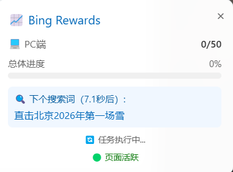
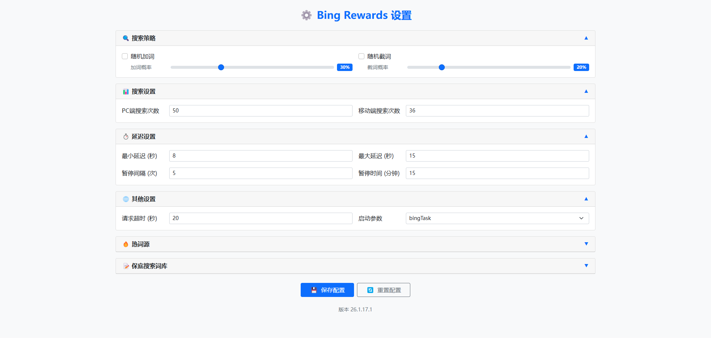

# Microsoft Bing Rewards Daily Task Script

自动化完成微软必应每日搜索任务，实时显示进度，轻松积累奖励积分。

## 项目简介

这是一个浏览器扩展（Chrome Extension），可以在安装后自动模拟人工搜索行为，帮助您完成 Microsoft Bing Rewards（微软必应奖励）的每日PC端和移动端搜索任务，节省您的时间。

## 核心功能特性

### 自动化与效率
- **全自动任务执行**：一键启动，自动完成当日所有可完成的搜索任务
- **智能进度管理**：自动计算并显示任务进度，清晰了解完成情况
- **实时状态面板**：在页面顶部实时显示当前搜索词、进度和剩余时间

### 智能模拟与安全
- **双端模式支持**：自动识别并模拟PC和手机两种设备环境进行搜索
- **动态搜索策略**：内置丰富词库，自动获取并随机使用热门搜索词，使行为更接近真人
- **隐私与混淆**：支持随机化用户代理（User-Agent），并对搜索词进行混淆处理，有效降低被识别为自动化脚本的风险
- **智能延迟控制**：可配置搜索延迟范围，避免短时间内大量搜索

### 用户体验
- **透明化操作**：在页面实时显示当前搜索词和任务进度
- **简易控制**：通过扩展图标提供清晰的控制界面
- **灵活配置**：提供详细的配置页面，可自定义各项参数
- **热词API源管理**：支持自定义PC端和移动端的热词API源
- **保底搜索词库**：内置搜索词库，API获取不足时自动补充

## 📸 效果展示

### 扩展弹出窗口
点击浏览器工具栏中的扩展图标，即可打开控制面板，一键启动任务。


### 实时状态面板
任务运行时，在 Bing 页面右下角显示实时状态面板。



### 设置页面
提供详细的配置选项，支持自定义搜索次数、延迟时间、热词API源等参数。



## 安装指南

### 第一步：下载扩展文件

从项目仓库下载所有文件，确保包含以下结构：

```
bing-rewards-extension/
├── manifest.json
├── background.js
├── content.js
├── popup.html
├── popup.js
├── options.html
├── options.js
├── README.md
├── images/
│   └── favicon.png
├── css/
│   ├── bootstrap.min.css
│   ├── options.css
│   └── popup.css
└── js/
    └── bootstrap.bundle.min.js
```

### 第二步：安装扩展

#### 🌟 推荐方式：使用 CRX 文件安装（Chrome/Edge/Brave）

**优点**：安装快速、操作简单、无需开启开发者模式

1. 从项目仓库下载已打包好的 `.crx` 扩展文件
2. 直接将 `.crx` 文件拖拽到浏览器窗口中
3. 在弹出的确认对话框中点击"添加扩展程序"
4. 等待安装完成，扩展图标将出现在浏览器工具栏中

**注意**：如果拖拽安装失败，请尝试以下备选方法：
- 将 `.crx` 文件后缀改为 `.zip`，解压后使用"加载已解压的扩展程序"方式安装
- 或直接使用下方的"加载已解压的扩展程序"方式

#### 备选方式：加载已解压的扩展程序（Chrome/Edge浏览器）

**适用场景**：未提供 CRX 文件或 CRX 安装失败时

1. 打开浏览器，访问 `chrome://extensions/`（Chrome）或 `edge://extensions/`（Edge）
2. 在页面右上角开启"开发者模式"
3. 点击"加载已解压的扩展程序"
4. 选择包含扩展文件的文件夹
5. 确认扩展已成功加载

#### Firefox浏览器：

1. 打开浏览器，访问 `about:debugging#/runtime/this-firefox`
2. 点击"临时载入附加组件"
3. 选择 `manifest.json` 文件
4. 确认扩展已成功加载

### 第三步：运行扩展

1. **登录账户**：在新的标签页中访问 https://www.bing.com，并确保已登录您的微软账户
2. **启动任务**：
   - 点击浏览器工具栏中的扩展图标
   - 在弹出菜单中点击"开始任务"按钮
3. **等待完成**：脚本开始运行后，请在页面顶部查看进度。请保持此标签页为前台激活状态，不要最小化浏览器或切换到其他标签，直至所有任务完成

## 配置说明

点击扩展图标中的"扩展设置"按钮，可以访问配置页面，自定义以下参数：

### 基础设置
- **PC端最大搜索次数**：设置PC端每日搜索的最大次数（默认50次）
- **移动端最大搜索次数**：设置移动端每日搜索的最大次数（默认36次）

### 搜索延迟设置
- **最小延迟**：两次搜索之间的最短间隔时间（秒）
- **最大延迟**：两次搜索之间的最长间隔时间（秒）
- **暂停间隔**：每执行多少次搜索后暂停一次
- **暂停时间**：每次暂停的持续时间（分钟）

### 搜索词混淆
- **随机加词**：是否在搜索词中随机添加字符（如：人工智能发展 → 人工1智能发z展）
- **随机加词因子**：控制加词的概率（0-1之间的小数）
- **随机截词**：是否随机截取搜索词（如：人工1智能发z展 → 人工1智）
- **随机截词因子**：控制截取的概率（0-1之间的小数）

### 热词API源管理
- **PC端热词源**：管理PC端搜索的热词API源，支持添加、编辑、删除
- **移动端热词源**：管理移动端搜索的热词API源，支持添加、编辑、删除

### 保底搜索词库
- **搜索词库**：自定义保底搜索词库，每行一个词
- **恢复默认**：一键恢复默认搜索词库

## ⚠️ 重要注意事项与常见问题

### 使用前提与运行环境
- **必须已登录**：使用前请在 Bing 网页版登录您的微软账户
- **保持页面激活**：浏览器标签页需处于前台活动状态，部分浏览器在页面后台时会限制脚本执行
- **网络要求**：需要稳定访问 Bing 国际站 (www.bing.com)

### 账户安全与风险提示
**重要**：使用自动化脚本存在理论上的账户风险，请合理谨慎使用。

**隐私声明**：本扩展仅在您当前访问的 Bing 网页上运行，不收集、不上传任何您的 Cookie 或个人信息。

**风险行为**：以下行为可能增加账号被微软系统标记的风险，建议避免：
- 在极短时间内（如几分钟内）完成全部每日搜索限额
- 频繁切换网络IP地址或使用不稳定的代理
- 每日都精准获取满分积分，毫无波动

**使用建议**：建议模拟真人使用习惯，例如不定时运行、不每日都用满额度等。

### 故障排除

#### 扩展未运行？
1. 确认扩展已安装并启用：在浏览器扩展管理页面中检查扩展是否已启用
2. 检查访问的网站：确保您打开的网址是 https://www.bing.com 或其子域名
3. 检查开发者模式：如果扩展无法正常运行，请确保已在浏览器扩展管理页面开启"开发者模式"
4. 重新安装：如果问题依旧，尝试移除扩展后重新加载

#### 搜索词获取失败？
1. 检查网络连接，确保可以访问热词API源
2. 在设置页面检查热词API源配置是否正确
3. 确认保底搜索词库中有足够的词

#### 进度显示异常？
1. 刷新页面后重新启动任务
2. 检查浏览器控制台是否有错误信息
3. 确认已登录微软账户

## 技术说明

### 扩展类型
基于 Chrome Extension Manifest V3 标准开发的浏览器扩展，运行于您的浏览器沙盒环境中。

### 工作原理
通过 DOM 操作模拟鼠标点击、键盘输入和等待延迟，自动在搜索框输入关键词并触发搜索。

### 主要组件
- **manifest.json**：扩展配置文件
- **background.js**：后台服务脚本，负责热词获取和状态管理
- **content.js**：内容脚本，在 Bing 页面中执行搜索任务
- **popup.html/js**：扩展弹出窗口，提供任务控制界面
- **options.html/js**：设置页面，提供参数配置界面

### 依赖库
- **Bootstrap 5.1.0**：用于UI样式和响应式布局
- **Bootstrap Bundle**：提供JavaScript交互组件

## 更新日志

### v26.1.15.1
- 优化设置页面布局，统一样式
- 添加保底搜索词库配置功能
- 修复时间单位转换错误
- 改进热词API源管理界面
- 优化卡片展开/收起动画效果

## 贡献与支持

我们欢迎并感谢所有的贡献，让这个工具变得更好！

### 报告问题与建议
如果您发现了 Bug 或有功能改进建议，请在项目的 Issues 页面提交。

### 贡献代码
欢迎 Fork 项目并提交 Pull Request 来帮助改进扩展。

### 讨论交流
关于使用中的任何疑问，也可以在项目的 Issue 区发起讨论。

## 许可证

本项目基于 MIT 许可证 开源。

完整许可证文本请查看项目根目录下的 LICENSE 文件。

本扩展仅供学习与交流自动化技术之用，请尊重微软必应奖励的服务条款，合理使用。

---

## 致谢

感谢 [keepa](https://gitee.com/idbb98) 的原始油猴脚本项目，本项目在此基础上进行了扩展化和功能增强。
