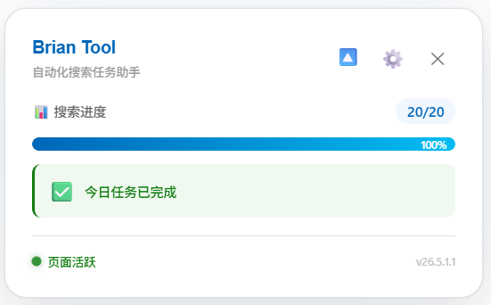
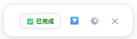
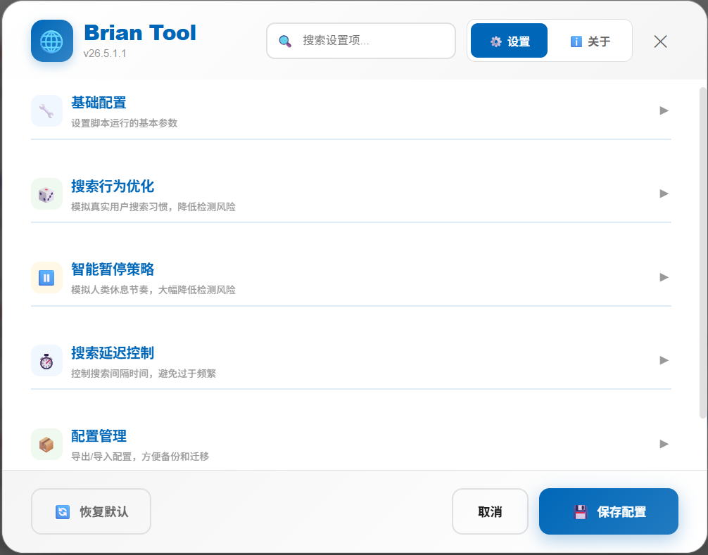

# Microsoft Bing Rewards 自动化工具集

> **🤖 自动化完成微软必应每日搜索任务，智能积累奖励积分**

本项目提供多种实现方式，帮助您自动完成 Microsoft Bing Rewards 的每日搜索任务，节省时间并轻松获取积分奖励。

---

## 📦 版本选择

本项目提供 **多种实现方式**，满足不同场景需求：

| 版本 | 技术栈 | 适用场景 | 特点 |
|------|--------|----------|------|
| 🌐 **浏览器脚本**（推荐使用） | JavaScript + Violentmonkey | 全平台浏览器 | 轻量便捷，无需安装 |
| 🖥️ **Python 桌面程序** | Python | Windows 用户 | 功能丰富，配置灵活 |
| 🧩 **浏览器扩展**（停止维护） | Chrome Extension (Manifest V3) | 全平台浏览器 | 双端搜索，无需脚本管理器 |
| 🪟 **.NET 桌面程序**（停止维护） | .NET Framework | Windows 用户 | 运行稳定，开箱即用 |

!!! tip "推荐选择"
    目前**推荐使用浏览器脚本版**：纯前端运行、无需安装依赖、跨浏览器支持，一键安装即可使用。

### 各版本文档直达

- [🐍 Python 桌面版 →](python/desktop.md) 基于 Python 实现的桌面自动化工具，支持 Windows 系统，配置灵活，功能丰富。
- [🪟 .NET 桌面版 →](dotnet/desktop.md) 基于 .NET Framework 开发的 Windows 桌面程序（**已停止维护**）。
- [🌐 浏览器脚本版 →](scripts/userscript.md) 纯粹的前端用户脚本，运行于浏览器沙盒环境中，跨平台支持，轻量便捷。
- [🧩 浏览器扩展版 →](extension/browser-extension.md) 基于 Manifest V3 的 Chrome 扩展，支持 PC / 移动端双端搜索（**已停止维护**）。

---

## ✨ 核心特性

### 🎯 智能自动化
- **全自动任务执行**：一键启动，自动完成当日所有搜索任务
- **智能进度管理**：实时显示任务进度与剩余时间，完成情况一目了然

### 🔒 安全模拟
- **动态搜索策略**：内置丰富词库，自动获取并随机使用热搜关键词
- **行为混淆技术**：支持随机化 User-Agent 与搜索词混淆，降低自动化识别风险
- **隐私保护**：纯前端运行，**不收集、不上传任何 Cookie 或个人信息**

### 🎨 现代 UI
- **实时状态面板**：优雅的渐变设计与流畅动画，实时追踪任务进度
- **可视化配置**：图形化设置界面，参数调整直观便捷
- **暗色主题支持**：自动适配系统级暗色模式

---

## 📸 界面预览

**展开状态 - 完整信息展示**

**收起状态 - 紧凑模式**

**设置面板**

**关于面板**

---

## ⚠️ 使用前提

- ✅ **必须登录**：使用前请在 Bing 网页版登录微软账户
- ✅ **保持前台**：浏览器标签页需处于前台活动状态
- ✅ **网络要求**：需稳定访问 Bing 国际站 (`www.bing.com`)

!!! danger "安全与风险提示"
    使用自动化工具存在理论上的账户风险，请合理使用。**建议模拟真人使用习惯，不定时运行，避免每日都用满额度。**

---

## 📄 开源许可

本项目基于 **MIT 许可证** 开源。

> ⚖️ **免责声明**：本项目仅供学习与交流自动化技术之用，请尊重微软必应奖励的服务条款，合理使用。

---

**⭐ 如果这个项目对您有帮助，欢迎 Star 支持！**
